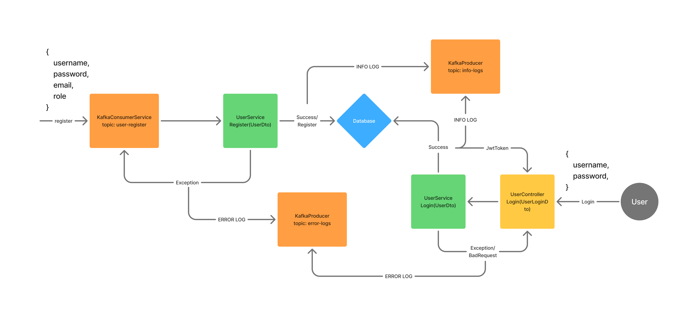

# SPRING + KAFKA

Microsserviço de autenticação utilizando mensageria kafka.

### Documentação:
Há um kafka consumer escutando o topico 'user-register', onde chega um usuário no formato:
```
{
    username,
    password (Hasheada com Bcrypt),
    email,
    role
}
```
Ao consumir a mensagem, o serviço a envia para o UserService com o intuito de fazer o registro do usuário. Se, por um acaso, o usuário já estiver registrado, é lançada uma exceção personalizada, UserAlreadyRegistered, que o Consumer captura em um try/catch e utiliza um ProducerService para lançá-la no tópico de erros, error-logs. Se o usuário for registrado com sucesso, é enviada uma mensagem para o tópico 'info-logs' dizendo que tal usuário se registrou, seguida pelo timestamp.

Com o registro efetuado, o usuário poderá chamar o endpoint POST auth/login, enviando nome, ou e-mail, e senha para tentar logar. Se obtiver sucesso, é enviado o JWT token de volta com e-mail e role do usuário com 120 minutos de expiration e um log para o tópico info-logs, informando o login e horário do usuário. Se houver algum problema, como usuário não registrado previamente ou senha incorreta, é enviada uma resposta de BadRequest via controller e um log de erro para o tópico error-logs.

---
#### Overview



#### Códigos principais:

KafkaConsumerService, responsável por registrar um usuário:
```
@RequiredArgsConstructor
@Service
public class KafkaConsumerService {

    private final UserService userService;
    private final KafkaProducerService kafkaProducerService;

    @KafkaListener(
            topics = "user-register",
            groupId = "user-handler",
            containerFactory = "kafkaListenerContainerFactory"
    )
    public void listenUserRegister(UserDto userDto) {
        try {
            userService.registerUser(userDto);
            kafkaProducerService.infoLogsSender(new LogMessageDto(getStringTimeStamp(), "INFO", "User " + userDto.username() + " registered successfully", "KafkaConsumerService"), "register");
        } catch (UserAlreadyRegistered e) {
            kafkaProducerService.errorLogsSender(new LogMessageDto(getStringTimeStamp(), "ERROR", e.getMessage(), "KafkaConsumer"), e.getClass().getSimpleName().toLowerCase());
        }
    }
}

```
KafkaProducerService, responsável por enviar logs:
```
@Service
@RequiredArgsConstructor
public class KafkaProducerService {

    private final KafkaTemplate<String, LogMessageDto> authLogTemplate;

    public void infoLogsSender(LogMessageDto LogMessageDto, String key) {
        authLogTemplate.send("info-logs", key, LogMessageDto);
    }

    public void errorLogsSender(LogMessageDto LogMessageDto, String key) {
        authLogTemplate.send("error-logs", key, LogMessageDto);
    }

}
```

UserService, responsável pela lógica de negócio:
```
@Service
@RequiredArgsConstructor
public class UserService {

    private final UserRepository userRepository;
    private final UserMapper userMapper;
    private final JwtService jwtService;

    public void registerUser(UserDto userDto) {
        userRepository.findByEmail(userDto.email()).ifPresent((user) -> {
            throw new UserAlreadyRegistered("Email already registered");
        });

        userRepository.findByUsername(userDto.username()).ifPresent((user) -> {
            throw new UserAlreadyRegistered("Username already registered");
        });

        userRepository.save(userMapper.userDtoToModel(userDto));
    }

    public String getLoginToken(UserLoginDto userLoginDto) {
        UserModel userModel;

        if (userLoginDto.username().contains("@")) {
            userModel = userRepository.findByEmail(userLoginDto.username()).orElseThrow(() -> new UserNotFound("Invalid Credentials"));
        } else {
            userModel = userRepository.findByUsername(userLoginDto.username()).orElseThrow(() -> new UserNotFound("Invalid Credentials"));
        }

        if (!BCrypt.checkpw(userLoginDto.password(), userModel.getPassword())) {
            throw new UserNotFound("Invalid Credentials");
        }

        return jwtService.generateToken(userMapper.userModelToDto(userModel));
    }
}

```

UserController, responsável pelo endpoint de login:
```
@RestController
@RequiredArgsConstructor
public class UserController {

    private final UserService userService;
    private final KafkaProducerService kafkaProducerService;

    @PostMapping("auth/login")
    public ResponseEntity<String> login(@RequestBody UserLoginDto userLoginDto) {
        String token = userService.getLoginToken(userLoginDto);
        kafkaProducerService.infoLogsSender(new LogMessageDto(getStringTimeStamp(), "INFO", "User " + userLoginDto.username() + " logged in successfully", "UserController"), "login");
        return ResponseEntity.ok().body(token);
    }
}
```